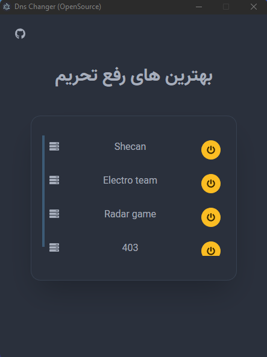
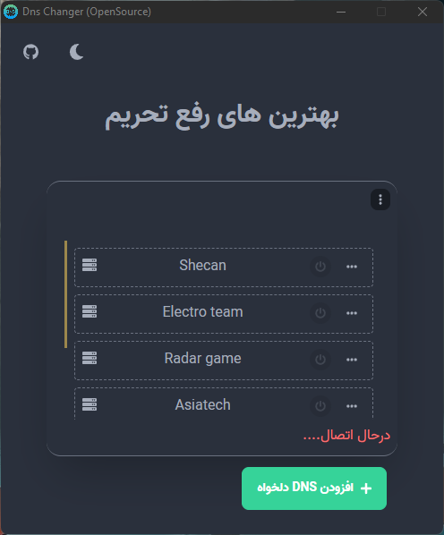
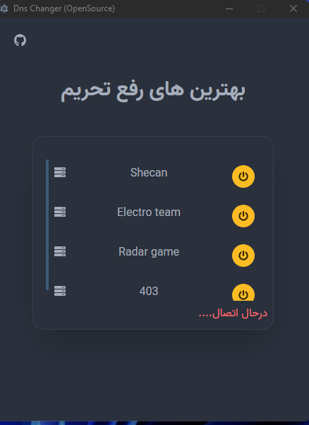
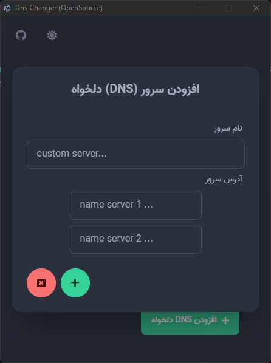

# ✍️ معرفی


[]()

<p align="center">
    
</p>

یک DNS Changer فارسی و اوپن سورس برای سیستم عامل های ویندوز ، مک و لینوکس که هدفش جمع آوری بهترین DNS ها در یک اپلیکیشن
امن هستش


## 📥 دانلود
برای دانلود به قسمت [releases](https://github.com/DnsChanger/dnsChanger-desktop/releases) مراجعه کنید.

## 🖼️ تصاویر

<p align="center">
    
</p>
<p align="center">
    
</p>
<p align="center">
    
</p>
<p align="center">
    
</p>

# 🗓️ لیست  تسک ها

- https://trello.com/b/Dg4jupkn/dnschanger

## 📝 لاگ تغییرات

شما میتونید [لاگ تغییرات](changelog.md) رو برای اطلاعات بیشتر و تغییرات اخیر مشاهده کنید

## 🛠️ همکاری

1.

```bash 
git clone https://github.com/DnsChanger/dnsChanger-desktop.git
```

2.

```bash
git checkout -b "my-new-feature"
```

3.

```bash
npm install
```

- developing...

4.

```bash
 git commit -am 'Add some feature'
```

5.

```bash
git push origin my-new-feature
```

- Submit a pull request

# 🧪 تست ها (unit test)

برای اجرای تست ها میتونید از دستور زیر استفاده کنید.

```shell
npm run test
```
